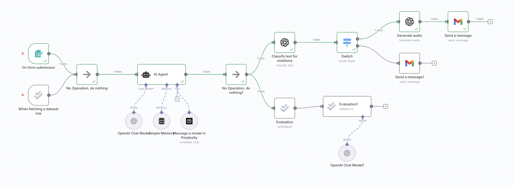

# N8N Hybrid AI Research & Learning Assistant

This repository contains an **AI agent workflow built with [n8n](https://n8n.io/)**.  
The agent takes a user’s query and time period, researches the topic, summarizes the findings, converts the summary into audio, and emails the audio file back to the user.  

💡 **Note**: This project started as a tutorial I followed to learn n8n. I’m documenting it here as part of my learning journey, and I plan to extend/customize it further.  

---

## 🖼️ Workflow Overview

Here’s the workflow as designed in n8n:

  

---

## 🚀 How the Agent Works

### 1. **Workflow Initiation**
- **Form Submission Trigger** → user provides:
  - **Topic** (e.g., *“vibe coding”*)  
  - **Time Period** (e.g., *“past 6 months”*)  
- **Dataset Row Trigger** (optional) → used during evaluations to pull test cases.

---

### 2. **Core AI Agent Logic**
- **AI Agent Node** orchestrates the process using:
  - **OpenAI Chat Model** → reasoning, summarization.  
  - **Perplexity API** → performs web research from reputable/primary sources.  
  - **Simple Memory** → maintains context between steps.  
- The agent produces a **text summary optimized for audio**.

---

### 3. **Safety Guardrails**
- **Classify Text for Violations** → OpenAI moderation checks for unsafe content.  
- **Switch Node** →  
  - If flagged → sends a **warning email**.  
  - If safe → continues workflow.

---

### 4. **Output Generation & Delivery**
- **Generate Audio** → converts the summary into an audio file.  
- **Send Message (Gmail)** → delivers the audio file to the user.  

---

### 5. **Evaluation & Metrics**
- **Evaluation → setOutputs**  
- **Evaluation1 → setMetrics**  
- **Google Sheets Integration** → stores test cases and metrics.  
- **OpenAI Evaluator Model** → scores outputs on helpfulness (1–5).  

---

## 🛠️ Tools & Services Used
- [n8n](https://n8n.io/) – workflow automation platform  
- **OpenAI GPT-4 Omni** – summarization, moderation, audio generation  
- **Perplexity API** – web research  
- **Gmail Node (n8n)** – email delivery  
- **Google Sheets** – evaluation and testing  
- **Switch Node (n8n)** – workflow branching for moderation guardrails  

---

## 📖 What I Learned
- How to connect multiple nodes in **n8n** into a robust workflow.  
- Using **prompt engineering** to define the agent’s role, tasks, and constraints.  
- Integrating **Perplexity API** for trusted research.  
- Setting up **content moderation** and conditional routing with Switch nodes.  
- Running **evaluation loops** with Google Sheets and OpenAI-based scoring.  

---

## 📌 Next Steps
- Extend to support **more output formats** (PDF, transcript).  
- Swap Gmail with a different email service.  
- Add a **frontend web interface** for better user interaction.  
- Improve evaluation metrics (accuracy, clarity, factuality).  

